<!-- Improved compatibility of back to top link: See: https://github.com/othneildrew/Best-README-Template/pull/73 -->
<a name="readme-top"></a>
<!--
*** Thanks for checking out the Best-README-Template. If you have a suggestion
*** that would make this better, please fork the repo and create a pull request
*** or simply open an issue with the tag "enhancement".
*** Don't forget to give the project a star!
*** Thanks again! Now go create something AMAZING! :D
-->


<!-- PROJECT SHIELDS -->
<!--
*** I'm using markdown "reference style" links for readability.
*** Reference links are enclosed in brackets [ ] instead of parentheses ( ).
*** See the bottom of this document for the declaration of the reference variables
*** for contributors-url, forks-url, etc. This is an optional, concise syntax you may use.
*** https://www.markdownguide.org/basic-syntax/#reference-style-links
-->


<h3 align="center">Simple Web Server</h3>

  <p align="center">
    Ningchen Liang
     </p>


<!-- TABLE OF CONTENTS -->

  
  <ol>
    <li>
      <a href="#about-the-project">About The Project</a>
      <ul>
         </ul>
    </li>
    <li>
      <a href="#getting-started">Getting Started</a>
      <ul>
        <li><a href="#prerequisites">Prerequisites</a></li>
           </ul>
    </li>
    <li><a href="#usage">Usage</a></li>
    <li><a href="#Multi thread">Multi thread</a></li>
    <li><a href="#option">Option</a></li>
    <li><a href="#license">License</a></li>
    <li><a href="#contact">Contact</a></li>
    <li><a href="#acknowledgments">Acknowledgments</a></li>
  </ol>


<!-- ABOUT THE PROJECT -->
## About the project


<p align="right">(<a href="#readme-top">back to top</a>)</p>


<!-- GETTING STARTED -->
## Getting Started

First open the compressed file and run the SimpleWebServer.java in/src/main/java
### Prerequisites


* maven
  


<!-- USAGE EXAMPLES -->
## Usage
First when you run the progeam, you will see the console shows"Listening from port."
Then open firefox, and enter url: http://localhost:8080
You will see the homepage if www.scu.edu.
Same page if you input http://localhost:8080/index.html

The orginal html file should be like this:

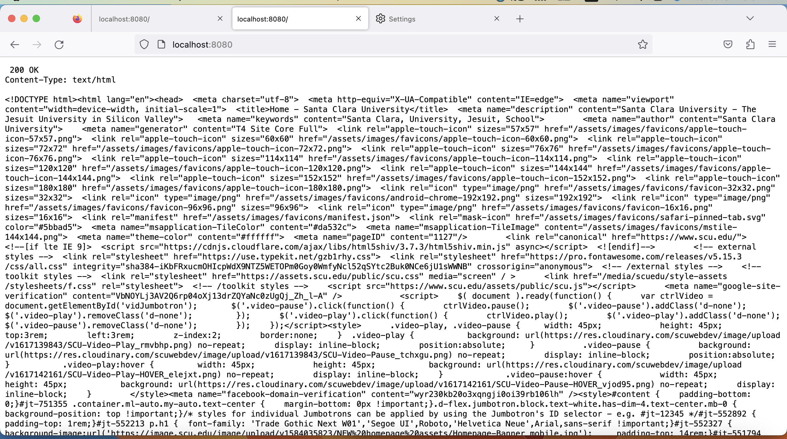

And you can try to retrieve different kinds of files.
Like http://localhost:8080/hi.txt
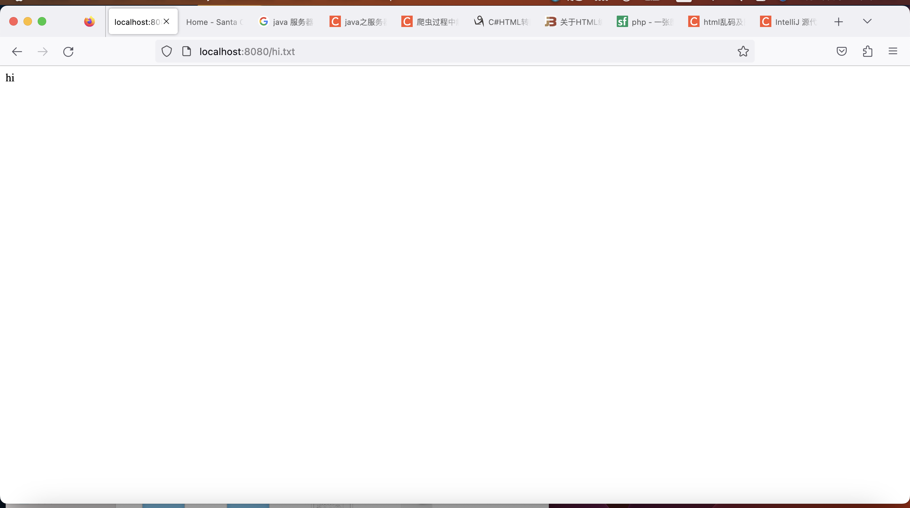

http://localhost:8080/house.jpeg
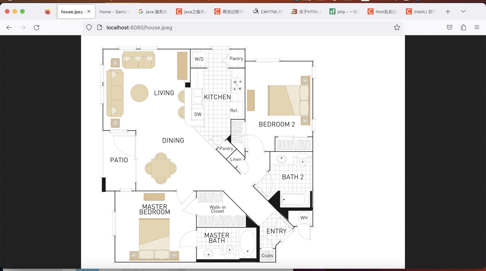

http://localhost:8080/giphy.gif
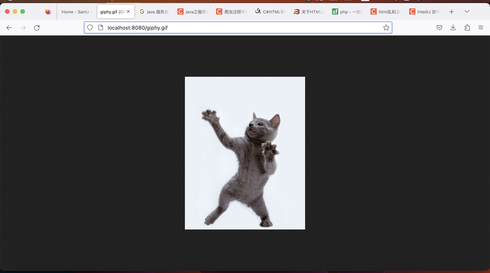

### Error handling
You can manipulate the code as follow to see error 400.
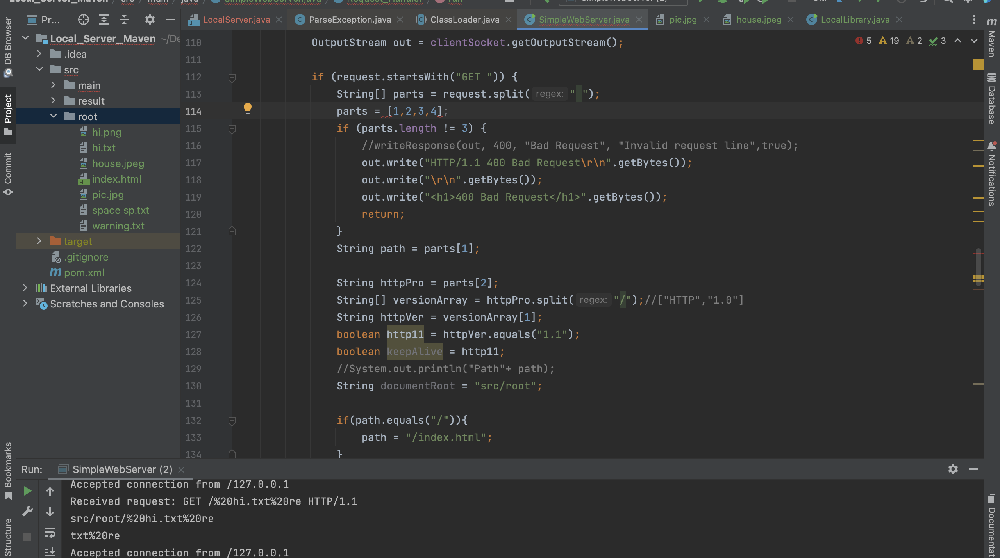
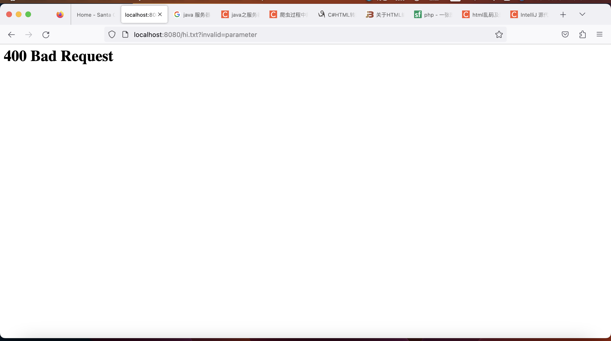

Then you will see 403 forbidden if you input http://localhost:8080/warning.txt
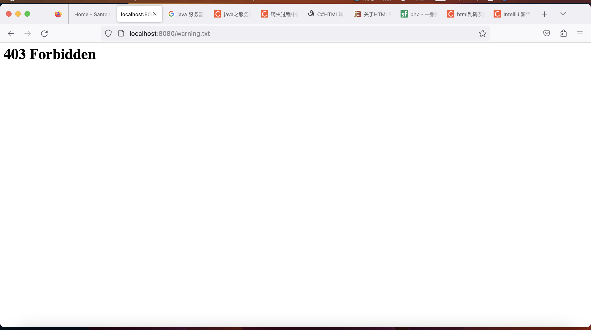

Because the readibility of that file is strictly denied as below:
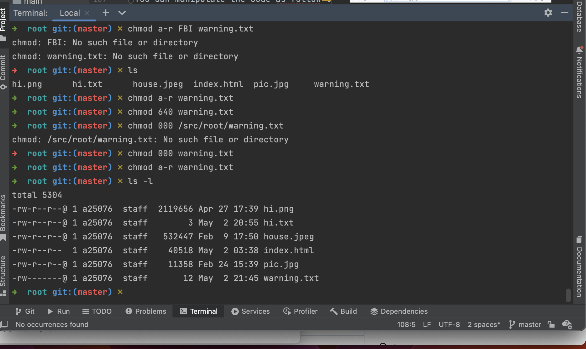

If you add something dose not exist, then the browser will return you 404 not found.
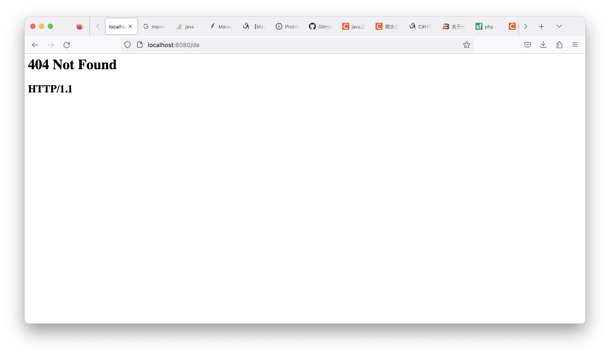

What's more, you can generate 501 by modifying code like that:
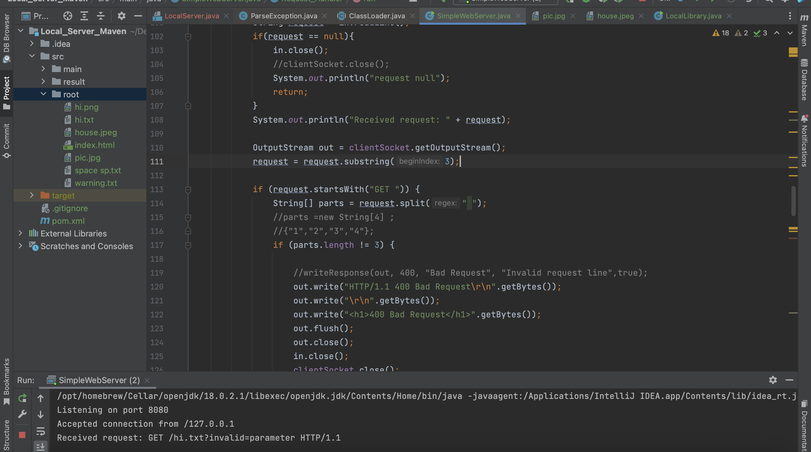
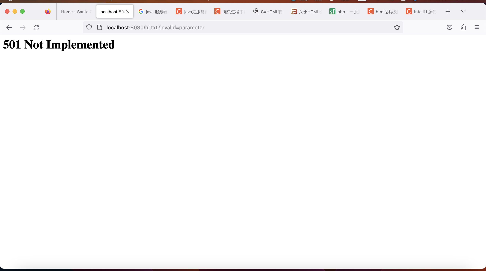

<p align="right">(<a href="#readme-top">back to top</a>)</p>


<!-- Multi thread -->
## Multi thread

Test the concurrency and multi thread by using both terminal and web browser to access the socket.
And duplicated access from the same client nodes.

<p align="right">(<a href="#readme-top">back to top</a>)</p>


<!-- Option -->
## Option

By taking a jar file, you can determine the port number.
First, gose to the root directary of project, where a jar file exists.
Run with whatever the port number you want(Like 9000).
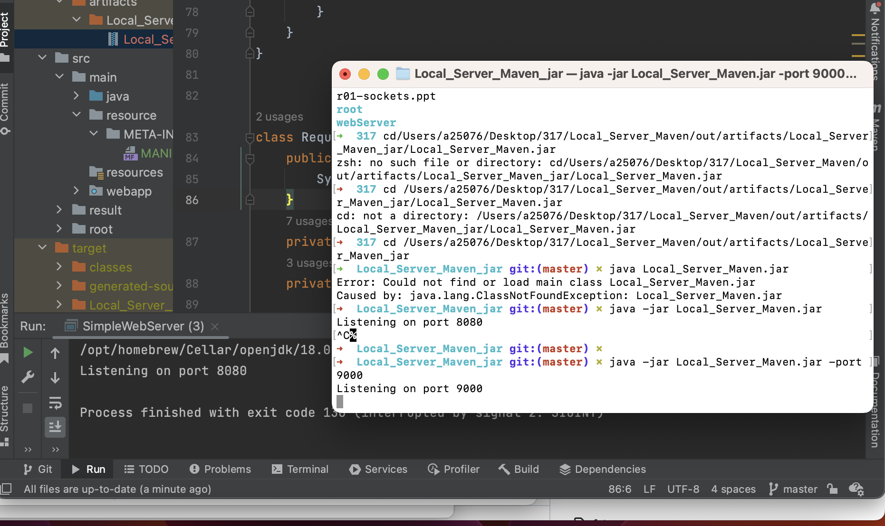

Open the web browser and input the localhost: plus the port number you just input.
Then you can see.
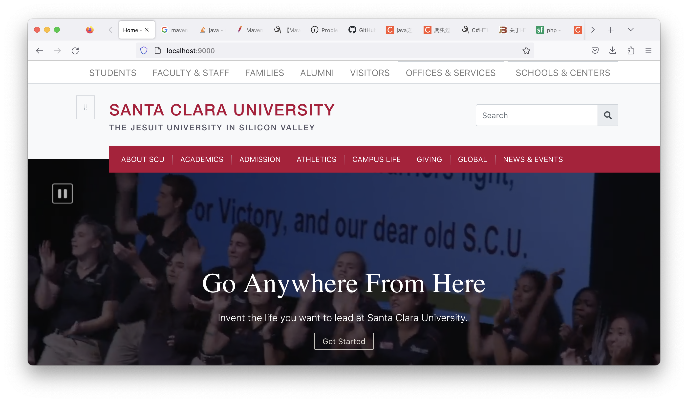


 ```sh
  java -jar Local_Server_Maven.jar -port 9000
  ```


<!-- LICENSE -->
## License

Distributed under the MIT License. See `LICENSE.txt` for more information.

<p align="right">(<a href="#readme-top">back to top</a>)</p>


<!-- CONTACT -->
## Contact

Your Name - Ningchen Liang 

email: nliang@scu.edu


<p align="right">(<a href="#readme-top">back to top</a>)</p>


<!-- ACKNOWLEDGMENTS -->
## Acknowledgments

* []()
* []()
* []()

<p align="right">(<a href="#readme-top">back to top</a>)</p>


<!-- MARKDOWN LINKS & IMAGES -->
<!-- https://www.markdownguide.org/basic-syntax/#reference-style-links -->
[contributors-shield]: https://img.shields.io/github/contributors/github_username/repo_name.svg?style=for-the-badge
[contributors-url]: https://github.com/github_username/repo_name/graphs/contributors
[forks-shield]: https://img.shields.io/github/forks/github_username/repo_name.svg?style=for-the-badge
[forks-url]: https://github.com/github_username/repo_name/network/members
[stars-shield]: https://img.shields.io/github/stars/github_username/repo_name.svg?style=for-the-badge
[stars-url]: https://github.com/github_username/repo_name/stargazers
[issues-shield]: https://img.shields.io/github/issues/github_username/repo_name.svg?style=for-the-badge
[issues-url]: https://github.com/github_username/repo_name/issues
[license-shield]: https://img.shields.io/github/license/github_username/repo_name.svg?style=for-the-badge
[license-url]: https://github.com/github_username/repo_name/blob/master/LICENSE.txt
[linkedin-shield]: https://img.shields.io/badge/-LinkedIn-black.svg?style=for-the-badge&logo=linkedin&colorB=555
[linkedin-url]: https://linkedin.com/in/linkedin_username
[product-screenshot]: images/screenshot.png
[Next.js]: https://img.shields.io/badge/next.js-000000?style=for-the-badge&logo=nextdotjs&logoColor=white
[Next-url]: https://nextjs.org/
[React.js]: https://img.shields.io/badge/React-20232A?style=for-the-badge&logo=react&logoColor=61DAFB
[React-url]: https://reactjs.org/
[Vue.js]: https://img.shields.io/badge/Vue.js-35495E?style=for-the-badge&logo=vuedotjs&logoColor=4FC08D
[Vue-url]: https://vuejs.org/
[Angular.io]: https://img.shields.io/badge/Angular-DD0031?style=for-the-badge&logo=angular&logoColor=white
[Angular-url]: https://angular.io/
[Svelte.dev]: https://img.shields.io/badge/Svelte-4A4A55?style=for-the-badge&logo=svelte&logoColor=FF3E00
[Svelte-url]: https://svelte.dev/
[Laravel.com]: https://img.shields.io/badge/Laravel-FF2D20?style=for-the-badge&logo=laravel&logoColor=white
[Laravel-url]: https://laravel.com
[Bootstrap.com]: https://img.shields.io/badge/Bootstrap-563D7C?style=for-the-badge&logo=bootstrap&logoColor=white
[Bootstrap-url]: https://getbootstrap.com
[JQuery.com]: https://img.shields.io/badge/jQuery-0769AD?style=for-the-badge&logo=jquery&logoColor=white
[JQuery-url]: https://jquery.com 
